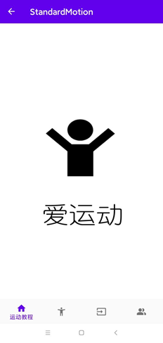

# "爱运动"APP

在学习Android开发时制作的APP，整体较为简单。针对中小学生体质测试的场景，获取处理运动时产生的数据，旨在基于计算机视觉技术对体育运动进行评价反馈。

## APP简介

### 功能模块

* 运动教程：展示体质测试各项运动的资讯以及技巧，还有运动视频。
* 开始运动：拍照以及拍摄视频，支持朋友圈分享运动视频。也可上传视频到服务端进行运动动作评价
* 视频上传：上传本地运动视频到服务端进行运动动作评价
* 个人中心：
  * 最近运动：详细查看最近一次的运动记录，运动记录包括运动时间、运动个数、运动建议以及运动积分
  * 运动记录：查看全部运动记录
  * 运动积分：每次运动产生运动积分，查看总运动积分。

### 相关技术

* 客户端采用Android Studio开发，注册APP首先申请联网、视频等权限，拍摄运动视频后通过okhttp传输框架将视频传输至服务端，并解析服务端返回结果。
* 服务端采用flask框架，创建数个api接口，分别对应手机端的新闻访问、视频上传以及个人数据访问功能。姿态估计采用腾讯人体关键点分析api。对于客户端传输的视频，首先取帧，然后调用api获取人体关键点，通过关键点计算各个特征，并采用FastDtw算法计算当前序列与标准序列的相似性，分析差异性矩阵来得到评价结果。